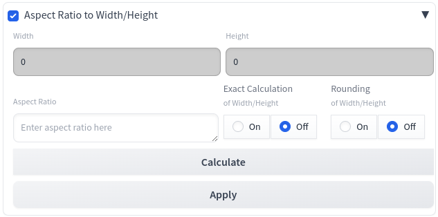

# Extension for the AUTOMATIC1111 Web UI
#### sd-webui-aspect_ratio2width_height Version 0.0.0.1

sd-webui-aspect_ratio2width_height is an <i>Extension</i> for the <a href="https://github.com/AUTOMATIC1111/stable-diffusion-webui">AUTOMATIC1111/stable-diffusion-webui</a>, which is adding a dropdown menu to the web UI for the selection of predefined <i>aspect ratios</i>.

---

# Preface

The aspect ratio has always been an important aspect of art over time. Since I could not find any suitable tools that did what I wanted, I tried to programme my own Extension for AUTOMATIC1111. Since that worked out successfully, I went on to programme interesting aspects around the topic of aspect ratios.

# Goal

The aim was to develop an extension that creates width and height from any given aspect ratio. It should also be possible to transfer the calculated data to the web UI.

# What the Extension Does

After installation one will find panel within the web UI which looks like the next one when it is opened.

# Development and Test Environment

The <i>Extension</i> was devolped and tested under Linux using the web UI AUTOMATIC111 with following specification:

* API: v1.10.0
* Python: 3.10.14
* torch: 2.1.2+cu121
* xformers: 0.0.23.post1
* gradio: 3.41.2

# Unresolved Question

The data transfer of the calculated values for width and height is not as straightforward as I would expect. It works and I understand why it works, but it's not elegant.

# Challenge

Especially with this <i>Extension</i> I had to struggle a lot with the functionality of <i>gradio</i> in my current version. Many things that should work according to the documentation of <i>gradio</i> did not work or only worked to a limited extent with sometimes bizarre results. I had to play tricks to create the interface in its present form.

# Reference

[1] https://github.com/AUTOMATIC1111/stable-diffusion-webui

[2] https://github.com/AUTOMATIC1111/stable-diffusion-webui-extensions
